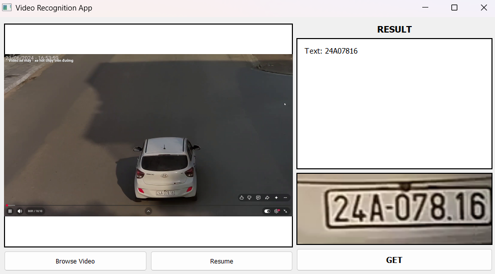
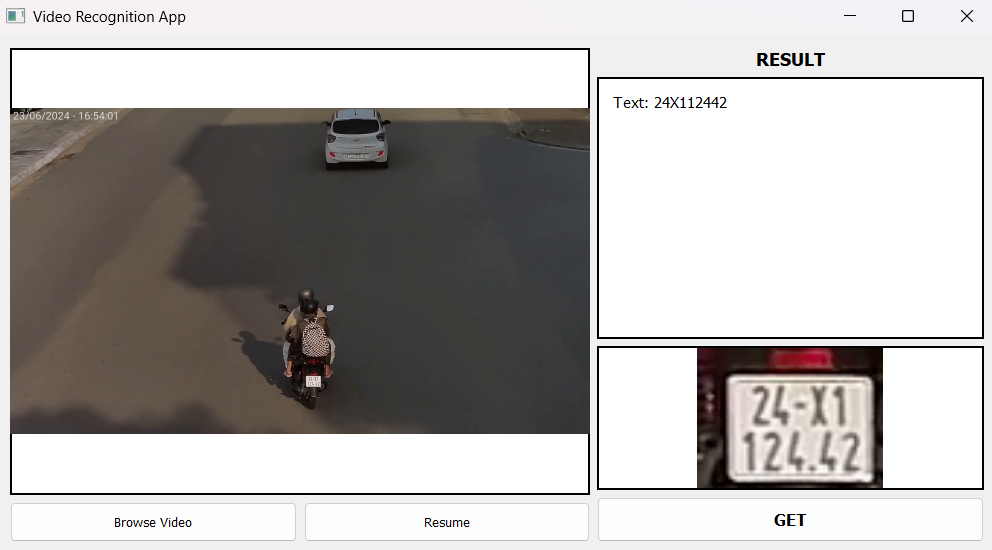
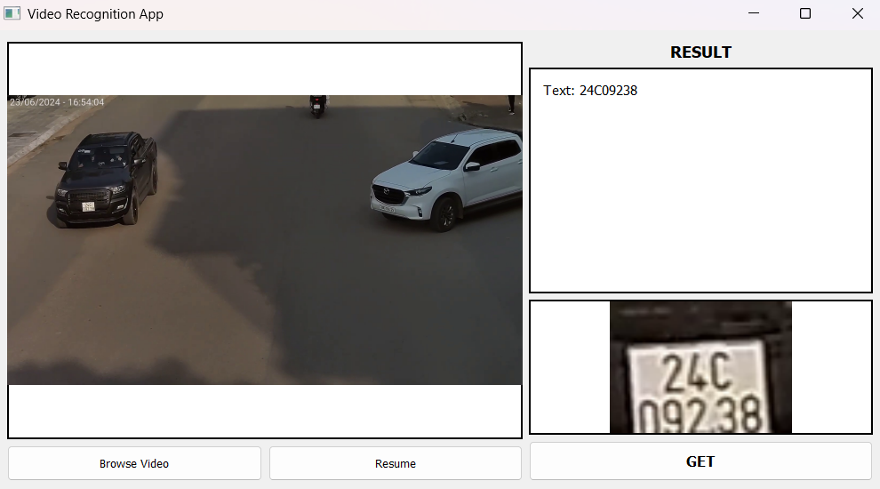

# Vietnamese Automatic License Plate Recognition

An Automatic License Plate Recognition (ALPR) system for Vietnamese vehicles, designed to process still images or individual video frames. The project combines two main stages: detecting the license plate with **Faster R-CNN or YOLO**, then recognizing the characters in the cropped plate image with a fine-tuned **DeepSeek-OCR** model.

The project includes:

- Dedicated CLI commands for the detector, OCR, and end-to-end pipeline.
- A PyQt5 desktop application for recognizing license plates from video frames.
- Checkpoints for Faster R-CNN, YOLO, and DeepSeek-OCR.
- Training data, training logs, and sample outputs.

## Architecture overview


### Main components

| Component | Technology | Purpose |
|---|---|---|
| Detector | Faster R-CNN MobileNet V3 Large FPN | Default detector for single-line and two-line license plates |
| Optional detector | YOLO11n | Alternative detector enabled with `--yolo True` |
| OCR | Fine-tuned DeepSeek-OCR | Recognizes characters from a cropped license plate image |
| Desktop app | PyQt5, OpenCV | Previews a video, pauses on a frame, and runs the complete pipeline |

The Faster R-CNN detector uses the following class mapping:

- `0`: background.
- `1`: long plate, typically a single-line car plate.
- `2`: square or two-line plate, typically a motorcycle plate.

## Demo

The screenshots below show the desktop application running on real-world video. The application displays the input frame, recognized text, and the license plate crop produced by the detector.

<table>
  <tr>
    <td align="center"></td>
    <td align="center"></td>
    <td align="center"></td>
  </tr>
  <tr>
    <td align="center">Single-line car plate</td>
    <td align="center">Two-line motorcycle plate</td>
    <td align="center">Two-line car plate</td>
  </tr>
</table>

## Project structure

```text
alpr_system/
├── app.py                         # PyQt5 desktop application
├── pyproject.toml                 # Package metadata, dependencies, and CLI entry points
├── requirements.txt              # Installs the project in editable mode
├── demo/                          # Desktop application screenshots
├── data/
│   ├── detect/                    # Detector dataset in COCO format
│   ├── crops/                     # Cropped plate images and OCR labels
│   └── test_img/                  # Images for testing inference
├── outputs/
│   ├── crop/                      # License plate crops created by the pipeline
│   ├── predictions/               # Pipeline results in JSON format
│   ├── ocr/                       # DeepSeek-OCR working directory
│   ├── logs/                      # Training logs
│   └── figure/                    # Evaluation plots
├── weights/
│   ├── detector/
│   │   ├── faster_rcnn/best.pth
│   │   └── yolo11n/best.pt
│   └── deepseek_ocr/deepseek_ocr_merged/
└── src/alpr/
    ├── paths.py                   # Centralized path configuration
    ├── pipeline.py                # Detector → crop → OCR pipeline
    ├── detector/                  # Detector models, dataset, training, and inference
    └── deepseek_ocr/              # OCR inference and fine-tuning notebook
```

## System requirements

- Python `>=3.10,<3.14`.
- An NVIDIA GPU and a CUDA-enabled PyTorch environment for OCR, the complete pipeline, and the desktop application.
- Enough disk space for the model checkpoints, especially the DeepSeek-OCR checkpoint.

> [!IMPORTANT]
> The Faster R-CNN detector can run on the CPU when CUDA is unavailable. However, custom code in the current DeepSeek-OCR checkpoint still invokes CUDA directly, so OCR-based workflows do not have complete CPU support.

## Environment setup

Run the following commands from the project root directory.

### Windows PowerShell

```powershell
py -3.12 -m venv .venv
.\.venv\Scripts\Activate.ps1
python -m pip install --upgrade pip setuptools wheel
python -m pip install -r requirements.txt
```

### Linux

```bash
python3.12 -m venv .venv
source .venv/bin/activate
python -m pip install --upgrade pip setuptools wheel
python -m pip install -r requirements.txt
```

`requirements.txt` installs the package in editable mode (`-e .`), while all runtime dependencies are declared in `pyproject.toml`. After installation, the `alpr-detect`, `alpr-ocr`, and `alpr-predict` commands will be available inside the virtual environment.

For CUDA inference, make sure the installed PyTorch build is compatible with the CUDA runtime and NVIDIA driver on the host machine. Verify the environment with:

```bash
python -c "import torch; print('PyTorch:', torch.__version__); print('CUDA:', torch.cuda.is_available()); print('Device:', torch.cuda.get_device_name(0) if torch.cuda.is_available() else 'CPU')"
```

## Model checkpoints

The code uses fixed paths defined in `src/alpr/paths.py`. Before running inference, make sure the following checkpoints are available:

| Module | Checkpoint path | Required for |
|---|---|---|
| Faster R-CNN | `weights/detector/faster_rcnn/best.pth` | Default detector, pipeline, and desktop app |
| YOLO11n | `weights/detector/yolo11n/best.pt` | Detector or pipeline with `--yolo True` |
| DeepSeek-OCR | `weights/deepseek_ocr/deepseek_ocr_merged/` | OCR, pipeline, and desktop app |

The DeepSeek-OCR directory must contain the extracted checkpoint, including its configuration, tokenizer, and model weights. The application does not load checkpoint archives directly from `.zip` files.

## CLI inference

Run all examples from the project root after activating the virtual environment.

### 1. OCR module

Use this command when you already have a cropped license plate image and only need character recognition:

```bash
alpr-ocr --img_path data/crops/images/car_1.jpg
```

Equivalent Python module command:

```bash
python -m alpr.deepseek_ocr.inference --img_path data/crops/images/car_1.jpg
```

The recognized text is printed to the terminal. The model working directory is created at `outputs/ocr/`.

### 2. Detector module

The CLI uses Faster R-CNN by default:

```bash
alpr-detect --img_path data/test_img/tt.jpg
```

Run the detector with YOLO11n:

```bash
alpr-detect --yolo True --img_path data/test_img/tt.jpg
```

Equivalent Python module command:

```bash
python -m alpr.detector.inference --img_path data/test_img/tt.jpg
```

The detector prints a dictionary containing `Score`, `Label`, and `BBox`, then opens the cropped image with the operating system's default image viewer. This module does not save the crop automatically; use the pipeline to save both the crop and JSON result.

Example output:

```python
{
    "Score": 0.96,
    "Label": 2,
    "BBox": [977, 902, 1037, 944]
}
```

### 3. End-to-end pipeline

The pipeline performs **detection → crop → OCR → result persistence**.

Run with the default Faster R-CNN detector:

```bash
alpr-predict --img_path data/test_img/tt.jpg
```

Run with YOLO11n:

```bash
alpr-predict --yolo True --img_path data/test_img/tt.jpg
```

Equivalent Python module command:

```bash
python -m alpr.pipeline --img_path data/test_img/tt.jpg
```

Example output:

```python
{
    "Score": 0.96,
    "Label": 2,
    "BBox": [977, 902, 1037, 944],
    "Text": "24X112442"
}
```

After each successful run, the pipeline creates:

- `outputs/crop/cropped_<n>.png`: the cropped license plate image.
- `outputs/predictions/results_<n>.json`: the confidence score, class, bounding box, and recognized text.

If the detector does not find a license plate, the CLI prints `Not found license plate in the image.` and does not run OCR.

## Desktop application

Start the application with:

```bash
python app.py
```

Usage:

1. Click **Browse Video** or drag and drop a video into the application window.
2. Click **Pause** on the frame you want to process.
3. Click **GET** to run the detector and OCR.
4. View the recognized license plate text and cropped plate in the result panel.

The application supports `.mp4`, `.avi`, `.mov`, `.mkv`, and `.webm` videos. Models are loaded on the first **GET** request and cached for subsequent inference runs. The desktop application currently always uses Faster R-CNN and writes crop/JSON artifacts to `outputs/`, just like the pipeline CLI.

## Reference detector results

The artifact stored in `outputs/logs/history.json` reports the following results after 50 training epochs:

| Metric | Test set |
|---|---:|
| mAP@50 | `0.9646` |
| mAP@50:95 | `0.7688` |

These values come from the training run stored in the repository and are not an automatically reproduced benchmark across different environments.

## Current limitations

- The project is currently an alpha/prototype.
- OCR and end-to-end workflows require CUDA.
- Faster R-CNN selects the detection with the highest confidence, and the pipeline processes only one license plate per image or frame.
- The YOLO path is experimental and currently targets license plate class `2`.
- The desktop application accepts video only and does not provide a detector selector.
- The project does not yet include automated tests, a REST API, a database, or CI/CD.

